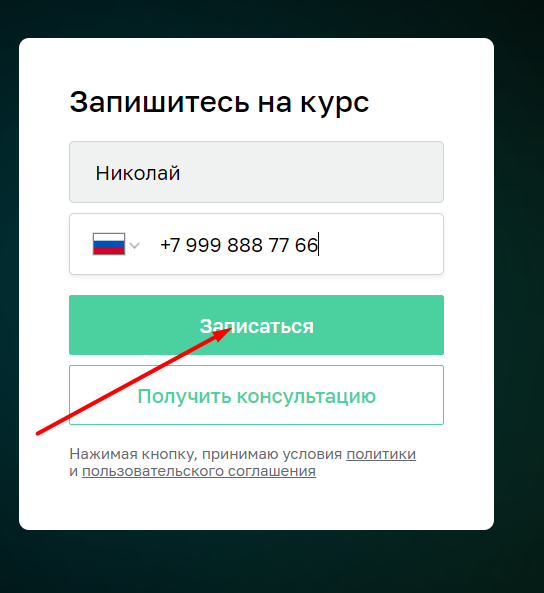

# План автоматизации тестирования сценария перехода к форме записи на обучение профессии «Инженер по тестированию» на сайте "Нетология" и заполнения этой формы.

## 1. Перечень автоматизируемых сценариев.

1.1 Сценарий навигации к форме записи:

- Открыть сайт [Нетология](https://netology.ru/).
- Нажать в верхней части старницы сайта на кнопку [Каталог курсов](): 
- В выпадающем списке выбрать направление нажав на кнопку [Программирование](): 
- На открывшейся [Странице](https://netology.ru/development) найти курс "Инженер по тестированию" и нажать на него:  
- На открывшейся [Старнице](https://netology.ru/programs/qa) нажать на кнопку "Записаться": 
- Осуществлен переход на место страницы, где доступна форма для заполнения на обучение профессии «Инженер по тестированию»: 

1.2 Сценарии заполнения и отправки формы записи на курс:

### Позитивный сценарий:
1. Заполнить поле "Имя" валидным значением на кириллице, например "Николай". 
#### `Ожидаемый результат: поле имя заполняется кириллицей со значением "Николай"`
2. Заполнить поле предназначенное для номера телефона, начинающегося с "+7" валидным значением латинскими цифрами, например "9998887766". 
#### `Ожидаемый результат: поле номера телефона заполняется латинскими цифрами со значением "+7 999 888 77 66"`
3. Нажать на кнопку "Записаться". 
#### `Ожидаемый результат: система выводит на экран сообщение об успешно оформленной заявке на обучение по программе  "Инженер по тестированию", а также дополнительной информации о том, что с клиентом свяжется куратор сайта.`

### Негативные сценарии:
###### 1. Заполенеие поля имени невалидным значением, поле телефон остается пустым.
1.1 Заполнить поле "Имя" не валидным значением на латиннице с добавлением спецсивола, например "Tom@s".
#### `Ожидаемый результат: поле имя заполняется значением на латиннице с добавлением спецсивола "Tom@s", система выводит оповещение о неккореткно введенном имени`
1.2 Поле предназначенное для номера телефона, начинающегося с "+7" оставляем незаполненным.
#### `Ожидаемый результат: поле номера телефона остается пустым`
1.3 Нажать на кнопку "Записаться". 
#### `Ожидаемый результат: система выводит сообщение о неккоретно введенных значениях полей, заявка не отправляется.`

###### 2. Заполенеие поля имени невалидным значением, поле телефона валидным значением.
2.1 Заполнить поле "Имя" не валидным значением на латиннице с добавлением спецсивола, например "Tom@s".
#### `Ожидаемый результат: поле имя заполняется значением на латиннице с добавлением спецсивола "Tom@s", система выводит оповещение о неккореткно введенном имени`
2.2 Заполнить поле предназначенное для номера телефона, начинающегося с "+7" валидным значением латинскими цифрами, например "9998887766". 
#### `Ожидаемый результат: поле номера телефона заполняется латинскими цифрами со значением "+7 999 888 77 66"`
2.3 Нажать на кнопку "Записаться".
#### `Ожидаемый результат: система выводит сообщение о неккоретно введенном значении поля "Имя", заявка не отправляется.`

###### 3. Заполенеие поля имени валидным значением, поле телефона невалидным значением.
3.1 Заполнить поле "Имя" валидным значением на латиннице, например "Tomаs". 
#### `Ожидаемый результат: поле имя заполняется значением на латиннице "Tomаs"`
3.2 Заполнить поле предназначенное для номера телефона, начинающегося с "+7" не валидным значением, а именно: оставляем пустым. 
#### `Ожидаемый результат: поле номера телефона остается пустым`
3.3 Нажать на кнопку "Записаться".
#### `Ожидаемый результат: система выводит сообщение о неккоретно введенном значении поля "Телефон", заявка не отправляется.`

## 2. Перечень используемых инструментов с обоснованием выбора.

1. Язык программирования Java 11, платформы для написания автотестов и их запуска JUnit4, JUnit5, TestNG + фреймворки Selenide / Selenium - все это хорошо подойдет в качестве инструментов для работы.
2. Maven или Gradle - как системы управления проектами, помогут правильно их организовать.
3. Среда разработки IntelliJ IDEA.
4. Для генерации тестовых данных планируется использовать фреймворк Faker, поэтому доступ к базе данных не потребуется.
5. Фреймворк Lombok поможет быстрее разобраться в логах и понять в чем может быть ошибки теста/продукта (сайта).
6. Actions Gradle поможет видеть всем процесс работы тестов.
7. Git - распределенная система управления версиями. Позволяет отслеживать любые изменения файлов, хранить их версию, оперативно возвращаться в любое сохраненное состояние.
8. GitHub - сервис для совместной разработки проекта. С помощью этого сервиса над кодом проекта может работать неограниченное число людей из любой точки мира.

## 3. Перечень необходимых разрешений, данных и доступов.
1. Получение письменного разрешения  от владельца сайта на выполнение автоматизированного тестирования сайта.
2. Получение доступа к базе данных и к API сайта.
3. Получение доступа к технической документации работы сайта.

## 4. Перечень и описание возможных рисков при автоматизации.
1. Отсутствие необходимых разрешений и доступов.
2. Отсутствие необходимых тестовых меток в HTML коде страницы сайта для поиска локаторов, что увеличивает время на разработку тестов.
3. Возможные изменения и апргрейды структуры сайта в ходе выполнения проекта приводит к устареванию использованных ранее в автосетсах локаторов.
4. Технические сбои работы сайта или базы данных.
5. Сложность сравнения результатов - ожидаемый/фактический.
6. Повышение требований к уровню тестировщика.

## 5. Перечень необходимых специалистов для автоматизации.
Достаточно одного инженера по автоматизированному тестированию.

## 6. Интервальная оценка с учетом риска в часах.
С учетом всех рисков на данном этапе необходим 1 автотестировщик. Один такой специалист может справиться с поставленным объемом работы, например за 3 рабочих дня (24 часа). Далее, нужно поддерживать тесты, адаптировать код под изменения, вносимые в проект.